# Linear Regression Analysis: Life Expectancy with Factors Related to Demography, Economy, Sociology, and Public Heath

#### Author: Yichen Zhao

#### Date: October 9, 2022

### Abstract

This report analyzes what factors of a country significantly impact the
nationwide life expectancy using techniques in multiple linear regression.
It examines potential multicollinearity, influential points, heteroscedasticity
and non-normality that will make the modeling estimation unreliable. It then
performs feature selection using different approaches involving t test for
single predictor, adjusted R squared, Mallow's Cp and backward stepwise BIC.
Lastly, it decides the final optimal model by performing 10-fold cross
validation on candidate models and choosing the one with the least total 
root-mean-square errors. This final model offers a statistical insight on what
factors are primarily responsible for life expectancy and how significant
the impacts are.

## Introduction

Life expectancy has long been a primary focus among all public health
concerns, and is the key metric for assessing population health. Broader
than the narrow metric of the infant and child mortality, which focus
solely at mortality at a young age, life expectancy captures the mortality
along the entire life course. It tells us the average age of death in a
population.

In this analysis, we would like to explore the relationship between
nationwide life expectancy and potential factors related to demography,
economy, sociology, and public health. Using techniques in linear regression
analysis, we search for a linear model that best describes what factors in
a society significantly impact life expectancy, and how significant is the
impact. This linear model provides an insight for a country to determine
the most essential predicting factors contributing to increment or decrement
in life expectancy, and to suggest which area should be given additional
attention in order to efficiently improve the life expectancy of its
population.

## Dataset and Data Cleaning

The Global Health Observatory (GHO) data repository under World Health
Organization (WHO) keeps track of the health status as well as many
other related factors for 193 countries between 2000 and 2015. Life
expectancy and health-related factors for all countries has been collected
from the GHO data repository and its corresponding economic and demographic
data was collected from United Nation website.

The raw dataset consists of 22 columns and 2938 records. Among the 22
columns, life expectancy is the response variable, and other 21 columns
are potential predictor variables. There are four predictor variables
that require our attention in data pre-processing:

1. The `Population` column contains a significant amount of missing values,
   which is about 1/5 of the records in raw dataset. We also noticed multiple
   cases of abnormal values in this column, such as a sudden drop in population
   for the same country in consecutive years. That being said, we decided to
   remove this column from consideration.
2. The `Measles` column is defined as number of reported measles cases per
   1000 people while contains about 17% of the records in raw dataset that is
   greater than 1000, which are abnormal values with given definition. With
   such a large proportion of abnormal values, we decided to remove this column
   from consideration.
3. The `percentage expenditure` column is defined as expenditure on health as
   a percentage of Gross Domestic Product per capita in percentage, while it
   contains about 44% of the records in raw dataset that is above 100, which
   we assume as abnormal values with given definition. With such a large
   proportion of abnormal values, we decided to remove this column from
   consideration.
4. The `Country` column is a categorical column and contains 193 different
   countries names. Such a large number of categories in a column is hazardous
   to modeling because one-hot encoding significantly increases the number of
   parameters in the linear model and makes the model estimation unreliable.
   Therefore, we regrouped the categories in `Country` column by replacing each
   country with its corresponding continent so that the new `continent` column
   has only 6 categories: Asia, Africa, North America, South America, Europe,
   and Oceania.

After dealing with the four specified columns above, we then checked missing
values in the remaining dataset as follows:

| Column Name        | Count of Missingness |
|--------------------|----------------------|
| life_expectancy    | 10                   |
| continent          | 112                  |
| developed          | 0                    |
| adult_mortality    | 10                   |
| under_five_death   | 0                    |
| infant_death       | 0                    |
| alcohol            | 194                  |
| hiv                | 0                    |
| bmi                | 34                   |
| thinness_child     | 34                   |
| thinness_teen      | 34                   |
| hepatitis_b        | 553                  |
| polio              | 19                   |
| diphtheria         | 19                   |
| gdp                | 448                  |
| health_expenditure | 226                  |
| icor               | 167                  |
| school_years       | 163                  |

We simply removed records that contains any missing values and left 1846
records with 18 columns in the cleaned dataset.

Furthermore, we checked for abnormality in other columns and noticed that
max value for `under_five_death` and `infant_deaths columns` are both above
1000 which are abnormal values since both columns are defined as counts per 
1000 people. Therefore, we dropped the records in which the values that are 
in the 1% percentile of either column and then observed a reasonable value
range for all columns.

At this point, we have done all the cleaning and the remaining dataset
is ready for further exploration and regression modeling. The cleaned
dataset has 1827 records with 18 columns which are defined as follows:

| Column Name        | Description                                                                                                   |
|--------------------|---------------------------------------------------------------------------------------------------------------|
| continent          | continent that the country of record belongs to                                                               |
| developed          | True for developed and False for developing                                                                   |
| adult_mortality    | number of dying between 15 and 60 per 1000                                                                    |
| infant_deaths      | number of infant death per 1000                                                                               |
| alcohol            | recorded per capita (15+) consumption in litres of pure alcohol                                               |
| hepatitis_b        | Hepatitis B immunization coverage among 1-year-old <br/>in percentage                                         |
| bmi                | average body mass index of entire population                                                                  |
| under_five_deaths  | number of under-five deaths per 1000                                                                          |
| polio              | Polio immunization coverage among 1-year-old in percentage                                                    |
| health_expenditure | government expenditure on health as a percentage <br/>of total government expenditure                         |
| diphtheria         | Diphtheria tetanus toxoid and pertussis immunization coverage<br/> among 1-year-old in percentage             |
| hiv                | Deaths per 1000 live births due to HIV/AIDS (0-4 years)                                                       |
| gdp                | Gross Domestic Product per capita (in USD)                                                                    |
| thinness_child     | prevalence of thinness among children and adolescents <br/>for Age 5 to 9 in percentage                       |
| thinness_teen      | prevalence of thinness among children and adolescents for <br/>Age 10 to 19 in percentage                     |
| icor               | income composition of resources, the Human Development Index in <br/>terms of income composition of resources |
| schooling          | number of years schooling                                                                                     |

## Exploratory Data Analysis

In this section, we provided some initial insights from the dataset.

We plottted the average life expectancy of each continent and sorted them in
descending order:


Europe has the highest continent-wide average life expectancy of 76.96
while Africa has the lowest of 60.39. The top three continents with highest
average life expectancy are Europe, North America, and South America in
this order.

In the following graph, we plotted the density distribution of life expectancy
of all developed countries compared to that of all developing countries.

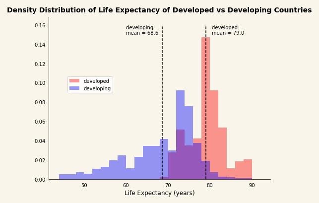

We see that life expectancy of developed countries has a larger mean
of 79.0 (compared to 68.6) and is more clustered around its mean than that of developing
countries.

Lastly, we plotted a heatmap for the correlation matrix of all numerical
predictor columns:

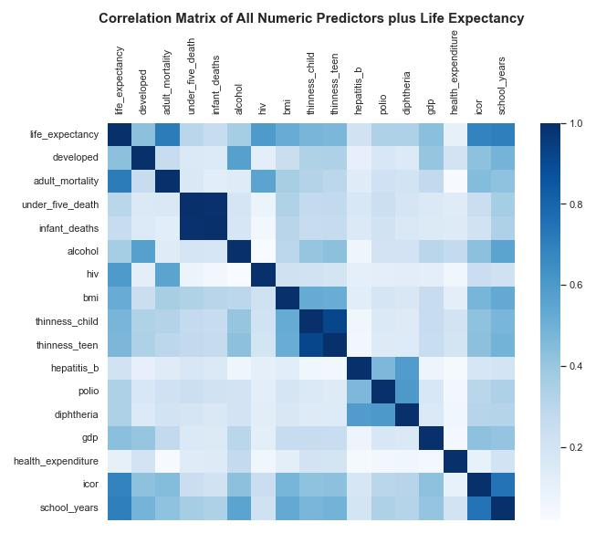

From the heatmap, the column `under_five_death` and `infant_deaths` are highly
correlated to each other; the column `thinness_child` and `thinness_teen` are
highly correlated to each other. This indicates that we might have significant
multicollinearity issues with the dataset that we need to fix later.

Focusing on the response column `life_expectancy`, the following table shows
top five columns with largest absolute value of correlation coefficient. This
provides us a brief overview on which column might have larger impact on the
nationwide life expectancy.

| Column Name     | Correlation |
|-----------------|-------------|
| adult_mortality | 0.714858    |
| school_years    | 0.705308    |
| icor            | 0.688267    |
| hiv             | 0.595300    |
| bmi             | 0.519589    |

## Linear Regression Modeling

We implemented statistical analysis in multiple linear regression and
determined the best model using all above-mentioned predictors as potential
predictors to regress on life expectancy.

We first fitted a linear model with all potential predictors using Ordinary
Least Squares Estimation (OLSE), namely this:

`life_expectancy` ~ `continent` + `developed` + `adult_mortality` + `under_five_death` + `infant_deaths` + `alcohol` + `hiv` + `bmi` + `thinness_child` + `thinness_teen` + `hepatitis_b` + `polio` + `diphtheria` + `gdp` + `health_expenditure` + `icor` + `school_years`

Starting from this initial model, we checked for model assumptions:

- multicollinearity
- influential points
- heteroscedasticity
- normality

and then implemented feature selection techniques, in other words, determined the
most contributing predictors in the model that maintains model performance
while removing non-informative predictors.

An overview of this process is provided as follows:

1. check multicollinearity and influential points using all potential predictors
    - multicollinearity: drop correlated columns, regularization, PCA
    - influential points: parallel analysis

2. fit initial model with all potential predictors

3. using initial model, check model assumption:
    - heteroscedacity
    - normality

4. model selection
    - t test: locate significant predictors
    - step AIC/BIC
    - R squared/adjusted R squared/Mallow's Cp with best subset

5. final model
    - fit the final model and report statistics

Multicollinearity and influential points are two major data structural problems
that most datasets have but will significantly influence model performance
from multiple aspects. To begin with, we first identified the source of
multicollinearity.

### Multicollinearity

From the above heatmap of correlation matrix, we suspected that there is
significant multicollinearity in the dataset. We followed by calculating
Variance Inflation Factor (VIF) score for each potential predictor, which
is listed in the table below:

| features                   | 	vif       |
|----------------------------|------------|
| continent[T.Asia]          | 	2.386897  |
| continent[T.Europe]        | 	3.863088  |
| continent[T.North America] | 	2.006951  |
| continent[T.Oceania]       | 1.802028   |
| continent[T.South America] | 1.737861   |
| developed[T.True]	         | 2.229834   |
| adult_mortality            | 1.893853   |
| under_five_death           | 	99.895127 |
| infant_deaths              | 	97.822211 |
| alcohol                    | 	2.825474  |
| hiv                        | 	1.618453  |
| bmi                        | 	1.814683  |
| thinness_child             | 	6.786899  |
| thinness_teen              | 	6.648050  |
| hepatitis_b                | 	1.641076  |
| polio                      | 	1.714906  |
| diphtheria                 | 2.065611   |
| gdp                        | 	1.383939  |
| health_expenditure         | 	1.171603  |
| icor                       | 	2.708259  |
| school_years               | 	3.326754  |

By "Rule of Thumb", both `under_five_death` and `infant_deaths` have a VIF
score greater than 10, which indicates that these two predictors are highly
correlated to other predictors, causing multicollinearity. Aware that records
in `infant_deaths` are also counted in `under_five_death`, we suspected that
they are correlated to each other.

To fix this problem, we first tried to remove `infant_deaths` to see how
we improve in multicollinearity. The VIF score table after removing
`infant_deaths` from the model looks like this:

| features                   | 	vif      |
|----------------------------|-----------|
| continent[T.Asia]          | 	2.181771 |
| continent[T.Europe]        | 	3.755207 |
| continent[T.North America] | 	1.930131 |
| continent[T.Oceania]       | 	1.749180 |
| continent[T.South America] | 	1.669333 |
| developed[T.True]          | 	2.226108 |
| adult_mortality            | 	1.880865 |
| under_five_death           | 	1.280095 |
| alcohol                    | 	2.819463 |
| hiv                        | 	1.616188 |
| bmi                        | 	1.814495 |
| thinness_child             | 	6.786897 |
| thinness_teen              | 	6.647317 |
| hepatitis_b                | 	1.640327 |
| polio                      | 	1.704707 |
| diphtheria                 | 	2.051647 |
| gdp                        | 	1.377849 |
| health_expenditure         | 	1.170613 |
| icor                       | 	2.704642 |
| school_years               | 	3.314856 |

Now VIF of every predictor is less than 10, and thus, by "Rule of Thumb",
there is no significant multicollinearity without the `infant_deaths` column.
Hence, we should exclude this column from the model. The current model after
fixing multicollinearity is:

`life_expectancy` ~ `continent` + `developed` + `adult_mortality` + `under_five_death` + `alcohol` + `hiv` + `bmi` + `thinness_child` + `thinness_teen` + `hepatitis_b` + `polio` + `diphtheria` + `gdp` + `health_expenditure` + `icor` + `school_years`

Next we identified influential points in the dataset.

### Influential Points

We checked for influential points in the dataset using two following methods:

- externally studentized residual:
    - By identifying the records where p value of externally studenized residual under a t-distribution is smaller than
      significance level (by default 0.05) as influential points, we identified 108 influential points using this
      approach. (Please refer to the notebook for the indices of these influential points. )
- Cook's distance
    - We calculated Cook's distance for each point and compared it with the commonly-used threshold 4/n where n is
      number of records in the dataset. We identified 113 records whose Cook's distance is greater than the threshold. (
      Please refer to the notebook for the indices of these influential points. )

We then treated the records that are both highlighted by both externally
studentized residual approach and Cook's distance approach as the influential
points in our dataset. In this way, we obtained 71 influential points. (Please
refer to the notebook for indices of these influential points. )

From this point, we performed parallel analysis using data with and without
these influential points. In other words, since influential points might cause
significant violation of other model assumptions like heteroscedasticity and
non-normality, we would consider exclude them from the dataset in order to
maintain a reliable statistical inference of the model when necessary.

### Fitting Initial Model

Although it is not required, it is often good practice to normalize all
numerical columns, including predictors and response, so that the units of
all regression coefficients are the same. The statistics test results are
often more human-readable with normalization, avoiding values that are either
negligibly close to 0 or extremely large.

We fitted the initial model with the noramlized dataset:

`life_expectancy` ~ `continent` + `developed` + `adult_mortality` + `under_five_death` + `alcohol` + `hiv` + `bmi` + `thinness_child` + `thinness_teen` + `hepatitis_b` + `polio` + `diphtheria` + `gdp` + `health_expenditure` + `icor` + `school_years`

and got the following summary table:

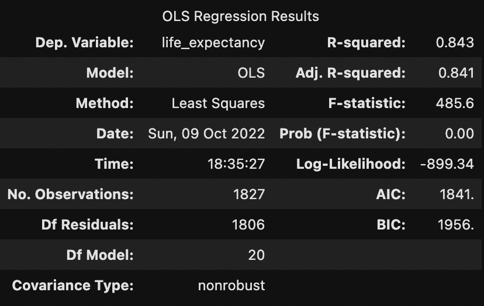

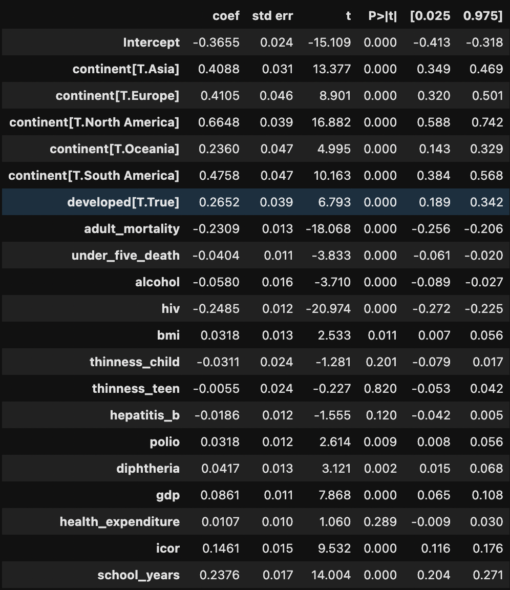


With this initial model, we checked whether model assumptions are violated,
namely:

- heteroscedasticity: error terms for all records have a constant variance
- normality: error terms for all records are governed by a normal distribution

### Heteroscedasticity

We plotted a residual plot to check whether the bandwidth of residuals vary as
fitted value changes. The following shows the residual plot of the initial model
we fitted:

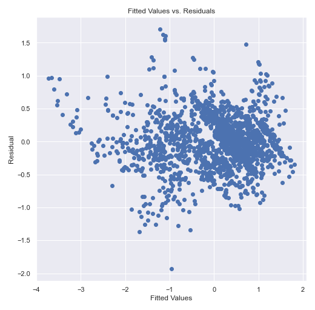

We saw from the residual plot that the variance of error is smaller with
lower fitted values, and larger as fitted value increases. Such pattern
indicates that there is noticeable heteroscedasticity in the model that
requires attention.

Alternatively, we conducted the Breusch-Pagan test to detect potential
problem with heteroscedasticity. The Breusch-Pagan test statistic is 257.281
with p value of 3.87 * 10^(-43) < 0.05, suggesting that the initial significantly
violates the assumption of constant variance in error terms.

To solve this issue, we used robust errors, i.e. Heteroscedasticity-Consistent
Standard Error (HCE), instead of OLSE-assumed constant variance, to perform all
further statistical tests with the model. For instance, after we refitted the
linear model with robust errors, the t tests results on significance of single
predictor using robust errors is listed as follows:

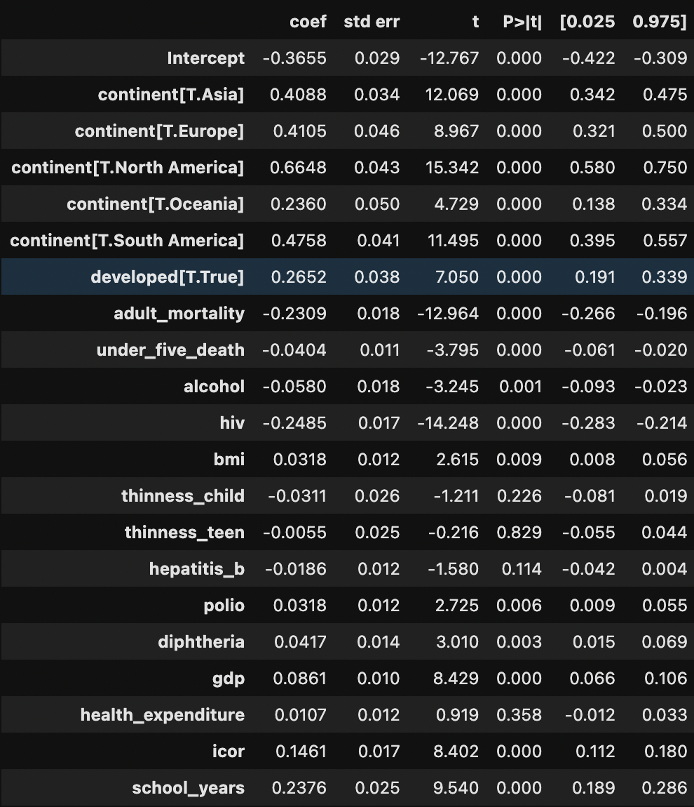

which is different from t test results using OLSE and non-robust errors.

### Non-normality

Next we checked normality assumption of the model with qq-plot and Jarque-Bera
test.

The qq-plot of current model is as follows:

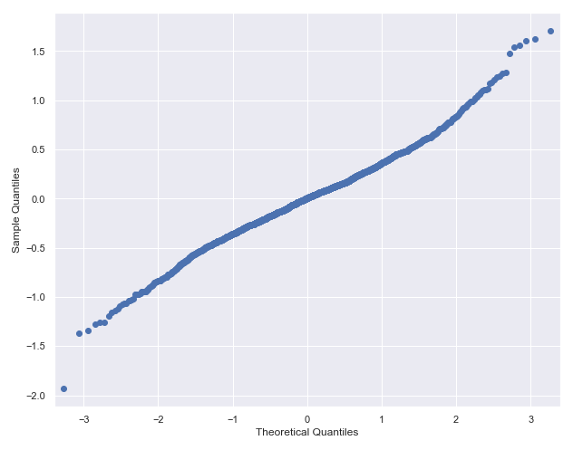

Both the summary statistics (skewness close to 0 while a large kurtosis of
4.394) and the qq-plot of current model indicate the distribution of errors is
symmetric with heavier tails than Gaussian.

Alternatively Jarque-Bera test produces a p value = 1.87 * 10^(-33) < 0.05,
indicating that there is significant violation of normality in the current
linear model.

Therefore, we tried fitting the model without influential points since
influential points might be the source of both heteroscedasticity and
non-normality.

The residual plot we got after fitting the model using dataset excluding
influential points:

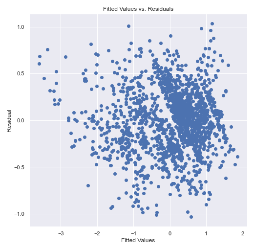

show non-constant bandwidth of residuals along the axis of fitted values.

The Breusch-Pagan test with p-value of 5.801 * 10^(-23) is still rejected,
suggesting that heteroscedasticity exists. We again used robust errors instead
to refit the model and get corrected test results.

The resulting qq-plot is:

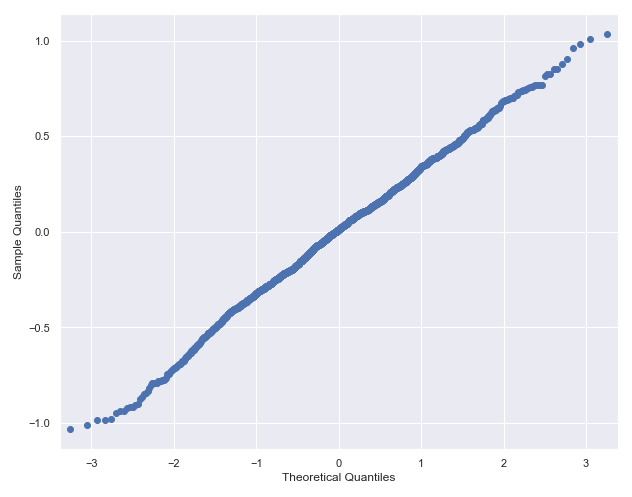

Now there is no pattern of significant violation of normality in the qq-plot,
and the Jarque-Bera test of p value being 0.167 is supporting the same statement.
Therefore, we shall stick with the dataset excluding influential points when
fitting all future models.

## Model Selection

Recall the model we currently regress:

`life_expectancy` ~ `continent` + `developed` + `adult_mortality` + `under_five_death` + `alcohol` + `hiv` + `bmi` + `thinness_child` + `thinness_teen` + `hepatitis_b` + `polio` + `diphtheria` + `gdp` + `health_expenditure` + `icor` + `school_years`

where `continent` and `developed` are categorical:

- `continent` contains six categories: `Asia`, `Africa`, `North America`, `South America`, `Europe`, and `Oceania`
- `developed` contains two categories: `True` and `False`

and all other predictors and response variable are numerical. We would refer this
model as the "full model" from this point in the report.

Additionally, Heteroscedasticity-Consistent Standard Errors are used when
regressing this linear model. The summary is as follows:

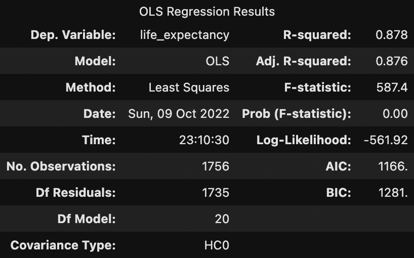

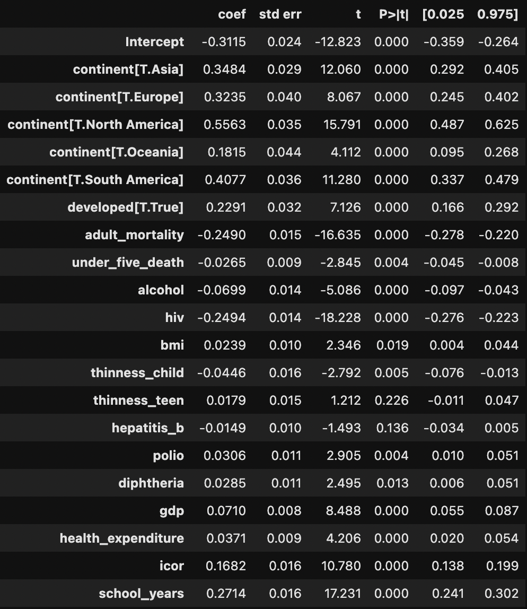


### First Approach

First approach we implemented for feature selection starts with reviewing t test
results to determine which predictors are significant to `life_expectancy`.

The two following predictors have a p value > 0.05 for t test on significance:

- `thinness_teen`
- `hepatitis_b`

Therefore, from the perspective of t test results, we should consider removing
these predictors from current model such that all remaining predictors are
statistically significant to `life_expectancy`, i.e. the model using t test
results for feature selection is:

`life_expectancy` ~ `continent` + `developed` + `adult_mortality` + `under_five_death` + `alcohol` + `hiv` + `bmi` + `thinness_child` + `polio` + `diphtheria` + `gdp` + `health_expenditure` + `icor` + `school_years`
.

Next step is, sing the above model as a baseline, we compare adjusted R squared
values and Mallow's Cp among all models that add one or more predictors onto 
this baseline model. 

| candidate_model           | adj_r_squared | 	mallows_cp | 	p  |
|---------------------------|---------------|-------------|-----|
| excluding both            | 	0.876100     | 	19.751772  | 	19 |
| excluding `hepatitis_b`   | 	0.876076     | 	21.096502  | 	20 |
| excluding `thinness_teen` | 	0.876175     | 	19.706209  | 	20 |
| full model                | 	0.876154     | 	21.000000  | 	21 |

For p = 19, Mallow's Cp is 19.75 which is reasonably close to 19, so the model
excluding both `thinness_teen` and `hepatitis_b` should be included into
consideration.

For p = 20, minimal Mallow's Cp is 19.71 which is also reasonably close to 20,
so the model excluding only `thinness_teen` should also be considered.

Mallow's Cp usually picks the shorter model when multiple models with different
number of parameters stand out. Therefore, we favored the model excluding both
`thinness_teen` and `hepatitis_b` using Mallow's Cp.

On the other hand, the model excluding only `thinness_teen` has the highest
adjusted R squared value among 4. Therefore, in summary, our candidate pool now
has two models:

- model excluding both `thinness_teen` and `hepatitis_b`
- model excluding only `thinness_teen`

We then calculated AIC and BIC values for both models and picked the final
decision.

| model                     | 	AIC         | 	BIC         |
|---------------------------|--------------|--------------|
| excluding both            | 	1164.622786 | 	1268.567868 |
| excluding `thinness_teen` | 	1164.554525 | 	1273.970401 |

Model excluding only `thinness_teen` has a slightly lower AIC while model
excluding both `thinness_teen` and `hepatitis_b` has a lower BIC. When the
conclusion using AIC does not agree with BIC, we, in practice, usually favor BIC
over AIC and thus, picked

`life_expectancy` ~ `continent` + `developed` + `adult_mortality` + `under_five_death` + `alcohol` + `hiv` + `bmi` + `thinness_child` + `polio` + `diphtheria` + `gdp` + `health_expenditure` + `icor` + `school_years`

as our final model using the approach described above.

### Second Approach

One alternative approach for feature selection is stepwise AIC/BIC. 
Implementing the backward stepwise algorithm, we start with the full model,
i.e. the model with all 16 predictors in `curr_lr_nofp`. We then attempted 
to remove predictors one by one to decrease AIC/BIC as large as possible, 
and stopped when removing any predictor in current model could not decrease 
AIC/BIC value. We chose to evaluate BIC values when implementing stepwise 
AIC/BIC.

The following displays the model update in each iteration during backward
stepwise BIC, starting from the full model. The algorithm stops when removing
any predictor from the model in iteration 4 does not decrease BIC value.

```
Starting point: full model
Full model: life_expectancy ~ continent + developed + adult_mortality + under_five_death + alcohol 
+ hiv + bmi + thinness_child + thinness_teen + hepatitis_b + polio + diphtheria + gdp 
+ health_expenditure + icor + school_years
Number of parameters: 21
Full model BIC: 1280.7265833625602

Iteration 1
Removed: thinness_teen
Current model: life_expectancy ~ continent + developed + adult_mortality + under_five_death + alcohol 
+ hiv + bmi + thinness_child + hepatitis_b + polio + diphtheria + gdp + health_expenditure + icor 
+ school_years
Number of paramaters: 20
Current model BIC: 1273.97040079515

Iteration 2
Removed: hepatitis_b
Current model: life_expectancy ~ continent + developed + adult_mortality + under_five_death + alcohol
+ hiv + bmi + thinness_child + polio + diphtheria + gdp + health_expenditure + icor + school_years
Number of paramaters: 19
Current model BIC: 1268.5678678217955

Iteration 3
Removed: diphtheria
Current model: life_expectancy ~ continent + developed + adult_mortality + under_five_death + alcohol 
+ hiv + bmi + thinness_child + polio + gdp + health_expenditure + icor + school_years
Number of paramaters: 18
Current model BIC: 1265.0695036077193

Iteration 4
Removed: bmi
Current model: life_expectancy ~ continent + developed + adult_mortality + under_five_death + alcohol 
+ hiv + thinness_child + polio + gdp + health_expenditure + icor + school_years
Number of paramaters: 17
Current model BIC: 1262.0001080104446
```

which means that using stepwise BIC method, the optimal model:

`life_expectancy` ~ `continent` + `developed` + `adult_mortality` + `under_five_death` + `alcohol` + `hiv` + `thinness_child` + `polio` + `gdp` + `health_expenditure` + `icor` + `school_years`
.

This optimal model is different from what we decided using first approach:

`life_expectancy` ~ `continent` + `developed` + `adult_mortality` + `under_five_death` + `alcohol` + `hiv` + `bmi` + `thinness_child` + `polio` + `diphtheria` + `gdp` + `health_expenditure` + `icor` + `school_years`
.

Hence, to decide a better model among the two, we performed ten-fold cross
validation and compared their prediction performance on
unseen datasets with the measure of fit being total root-mean-square errors
(RMSE):

```
10-fold cross validation:
Total root-mean-square errors (first approach): 3.1511667391862903
Total root-mean-square errors (second approach): 3.1592307440989567
```

The optimal model from first approach has a smaller total RMSE, 
indicating that we would choose the model from first approach:

`life_expectancy` ~ `continent` + `developed` + `adult_mortality` + `under_five_death` + `alcohol` + `hiv` + `bmi` + `thinness_child` + `polio` + `diphtheria` + `gdp` + `health_expenditure` + `icor` + `school_years`

as our final choice of model that best estimates the relationship between 
the nationwide life expectancy and factors listed above.

## Conclusion

The summary statistics including the coefficient estimates and
other statistics and test results) is as follows:

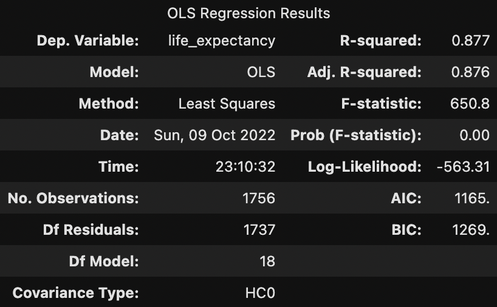

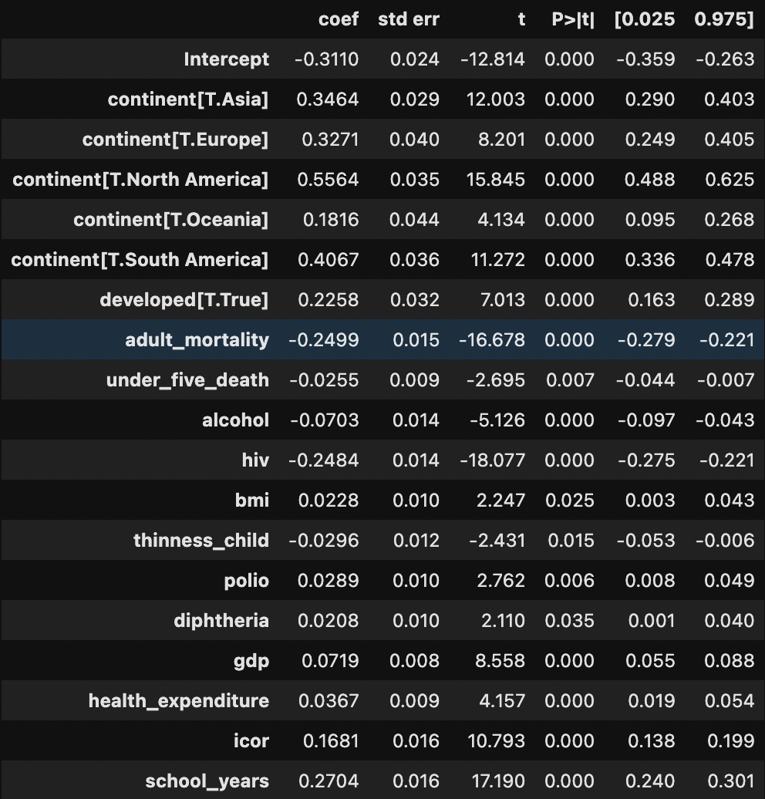


This model shows that life expectancy has a positive relationship with

- the country being developed over developing
- body mass index
- immunization rate of Polio (Pol3)
- immunization rate of Diphtheria Tetanus Toxoid and Pertussis (DTP3)
- GDP
- government expenditure on health
- income composition of resources
- number of years being educated

and is being negatively impacted by:

- adult mortality
- under 5 deaths
- HIV deaths
- alcohol consumption
- thinness among children (5 - 9 years old)

and has a significant relationship with demographic location of a country,
in other words, which continent the country belongs to.

Note that the above summary statistics treats Africa as a reference level
for the `continent`column and thus, the coefficient for each dummy variable
of `continent`describes life expectancy of current level compared to Africa
as reference level. For instance, coefficient of `continent[T.North America]`
being 0.5564 indicates that given the same value for all other predictors in
the model, life expectancy is expected to increase by 0.5564 if `continent`
switches from `Africa` to `North America`.

This model gives a overview of which factors in demography, economy, sociology,
and public health heavily impacts life expectancy of a nation, and how
significant each impact is. Using this model, we are provided an initial
insight of what we should do to increase life expectancy and bring improvement
to population health.

## References

1. https://ourworldindata.org/life-expectancy#:~:text=Life%20expectancy%20is%20the%20key,of%20death%20in%20a%20population
   .
2. https://www.kaggle.com/datasets/kumarajarshi/life-expectancy-who


